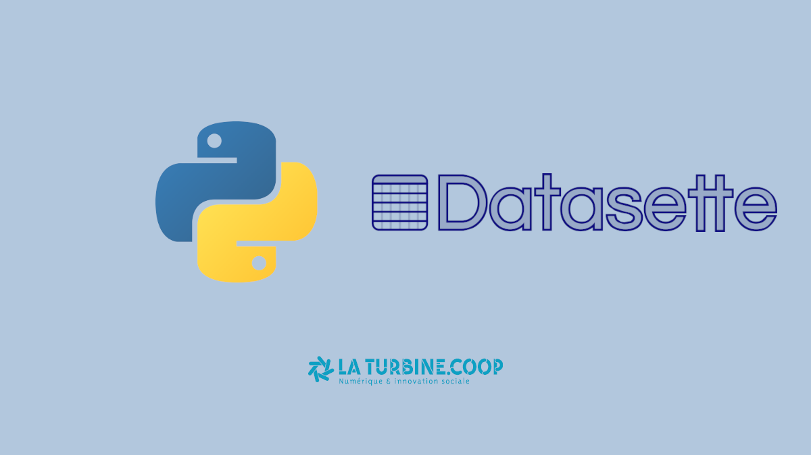

# Datasette Workshop

> Exploration de données avec Datasette

Ce dépôt Git contient toutes les ressources nécessaire pour participer à l'atelier "Exploration de données avec [Datasette](https://datasette.io)" organisé par le [Meetup Python Grenoble](https://meetup-python-grenoble.github.io) le 25 mai 2023.

Pour commencer l'atelier : https://meetup-python-grenoble.github.io/datasette-workshop

## Jeux de données

Les jeux de données suivants sont utilisés dans cet atelier :
- [Demandes de valeurs foncières géolocalisées](https://www.data.gouv.fr/fr/datasets/demandes-de-valeurs-foncieres-geolocalisees/)
    - Licence : `Licence Ouverte / Open Licence version 2.0`
- [France Geojson](https://github.com/gregoiredavid/france-geojson/)
    - Licence : `Licence Ouverte / Open Licence version 2.0`

Pour construire automatiquement la base de données SQLite `data.db` à partir du jeu de données :

```bash
./build.sh
sqlite3 data.db "select count(*) from dvf"
```

Le schéma SQL de la base de données SQLite est disponible dans le script [`schema.sql`](schema.sql).
