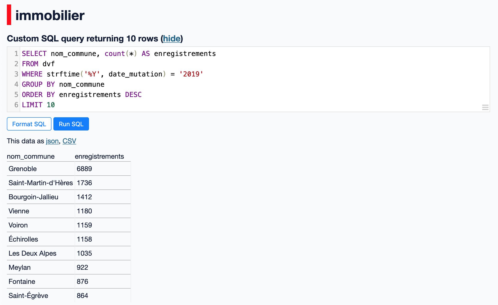

# Exploration de données

Datasette a été initialement conçu comme une application d'exploration et d'analyse de données pour le [journalisme](https://datasette.io/for/data-journalism). Les deux manière majeure d'effectuer ces tâches se font au travers de l'interface web et de l'interpréteur SQL.

## Interface Web

Sans taper une ligne de code SQL, nous pouvons commencer nos explorations directement avec l'interface web de Datasette, un peu à la manière d'un tableur.

### Tri

Pour trier les données d'une table selon une colonne, nous pouvons accéder au menu contextuel de colonne (en forme d'engrenage ⚙️) et de sélectionner "Sort ascending" (tri croissant) ou "Sort descending" (tri décroissant) :


Il est également possible de cliquer directement sur le nom d'une colonne : un fois pour un tri croissant, deux fois pour un tri décroissant.

### Filtrage

Pour trier les données d'une table, il est possible d'utiliser le formulaire de filtres :

1. Sélectionner la colonne
2. Sélectionner l'opérateur de comparaison
3. Taper la valeur
4. Cliquer sur "Apply"

Par exemple, pour filtrer les DVF uniquement sur les ventes d'appartement à Grenoble :


Vous pouvez combiner autant de filtres désirés, et l'utilisation judicieuse de tous opérateurs de comparaison disponibles permet généralement d'accéder au sous-ensemble de données recherchées.

### Facettes

Datasette permet également d'explorer les données avec une [_recherche à facettes_](https://fr.wikipedia.org/wiki/Recherche_%C3%A0_facettes) permettant [d'augmenter l'interface web](https://docs.datasette.io/en/stable/facets.html) avec des critères de sélection basés sur les valeurs de colonnes.

Pour analyser une colonne avec une facette, cliquer sur le menu contextuel (⚙️) puis sélectionner "Facet by this" :


Par exemple, en sélectionnant des facettes pour le type de mutation et du type de local, nous obtenons une analyse des DVF avec le nombre de lignes pour chaque valeur correspondante :


Lorsque les facettes sont affichées, il est possible de cliquer une sur valeur pour déclencher un filtre des données. Par exemple, en cliquant sur le type de local "Maison", nous obtenons la vue suivante (remarquez la mise à jour des valeurs pour la facette de nature de mutation) :


## SQL

Lorsque l'interface web de Datasette ne suffit plus pour analyser ou extraire les données souhaitées, il possible d'utiliser des requêtes SQL directement.

Pour accéder à l'interpréteur SQL, il est possible de continuer une recherche depuis l'interface puis de cliquer sur "View and edit SQL" :


ou bien de passer la vue de la base de données :


Dans les deux cas, nous obtenons un éditeur de requêtes SQL, avec affichage du résultat de la requête courante :


Toutes les fonctionnalités SQL supportées par SQLite sont ainsi disponibles dans Datasette :

- [Fonctions _scalaires_](https://www.sqlite.org/lang_corefunc.html) : `abs`, `lower`, `random`, etc.
- [Fonctions _d'agrégations_](https://www.sqlite.org/lang_aggfunc.html) : `count`, `sum`, `avg`, etc.
- [Fonctions de _fenêtrage_](https://www.sqlite.org/windowfunctions.html#biwinfunc) : `row_number`, `rank`, etc.
- [Fonctions de date et temps](https://www.sqlite.org/lang_datefunc.html) : `date`, `time`, `strftime`, etc.
- [Fonctions mathématiques](https://www.sqlite.org/lang_mathfunc.html) : `ceil`, `floor`, `sin`, `cos`, etc.
- [Fonctions et opérateurs JSON](https://www.sqlite.org/json1.html) : `json_array`, `json_object`, `->`, `->>`, etc.
- [Jointures](https://www.sqlite.org/syntax/join-clause.html) : `INNER JOIN`, `LEFT JOIN`, `CROSS JOIN`, etc.
- [CTE](https://www.sqlite.org/lang_with.html) : `WITH ... AS`, etc.

Il est également possible d'utiliser des extensions SQLite natives (ex : [SpatiaLite](https://docs.datasette.io/en/stable/spatialite.html)) ainsi que de définir des [fonctions SQL personnalisées](https://docs.datasette.io/en/stable/plugin_hooks.html#prepare-connection-conn-database-datasette).

Par exemple, pour obtenir les dix communes avec le plus grand nombre d'enregistrements sur l'année 2019 nous pouvons utiliser la requête SQL suivante :

```sql
SELECT nom_commune, count(*) AS enregistrements
FROM dvf
WHERE strftime('%Y', date_mutation) = '2019'
GROUP BY nom_commune
ORDER BY enregistrements DESC
LIMIT 10
```

En tapant cette requête SQL dans l'éditeur de Datasette, nous obtenons les données suivantes :



## Export

Dès lors que les données recherchées ont été obtenus (que ce soit via l'interface web et/ou par requête SQL), il est possible d'exporter les données au format CSV ou JSON en cliquant sur un des liens mentionné comme "This data as json, CSV".

Des plugins permettent d'ajouter des [formats d'exports additionnels](https://datasette.io/plugins?q=export).

## Déploiement

Enfin, un des objectifs du projet Datasette est la [publication de données](https://datasette.io/for/publishing-data). Nous ne couvrirons pas cet aspect dans cet atelier mais sachez qu'il est très simple de déployer une instance de Datasette embarquant une ou plusieurs bases de données SQLite sur un hébergement moderne de type _serverless_ (Google Cloud Run, Vercel, Fly.io, Heroku, etc.).
