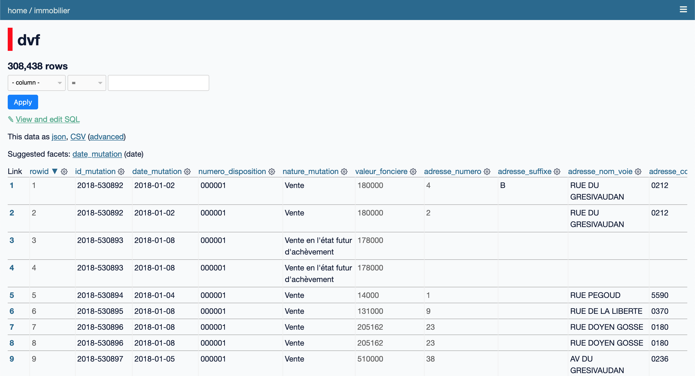

# Tour d'horizon de Datasette

Avant de commencer à analyser des données, prenons quelques minutes pour comprendre comment fonctionne Datasette. Pour obtenir tous les détails d'utilisation de Datasette, veuillez vous référer à la [documentation officielle](https://docs.datasette.io).

## Interface web

Datasette permet de visualiser une ou plusieurs bases de données [SQLite](https://www.sqlite.org).
C'est le seul type de base de données compatible avec Datasette pour le moment.

Par exemple, pour démarrer Datasette avec la base de données de l'atelier `data.db` :

```bash
datasette data.db
```

En accédant à l'interface web via l'URL affichée dans le terminal, on obtient :


La page d'accueil de Datasette liste les bases de données associée (ici `data` uniquement) avec quelques informations complémentaires :

- `data` : le nom de la base de données SQLite (extrait depuis le nom du fichier)
- `27,872 rows in 2 tables` : indication du nombre total de lignes et de tables contenues dans la base
- `dvf, communes` : la liste des tables contenues dans la base

En cliquant sur `data`, nous obtenons une vue détaillée de la base de données :


La vue de base de données donne plus d'informations sur chacune des tables de la base de données : nom, colonnes, nombre de lignes. Elle permet également de lancer des requêtes SQL.

En cliquant sur la table `dvf`, nous obtenons la vue d'exploration de données principale :



Nous utiliserons principalement cette vue pour [l'exploration de données](exploration.md).

## Métadonnées

### Générales

### Plugins

## Plugins
