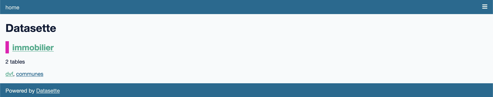
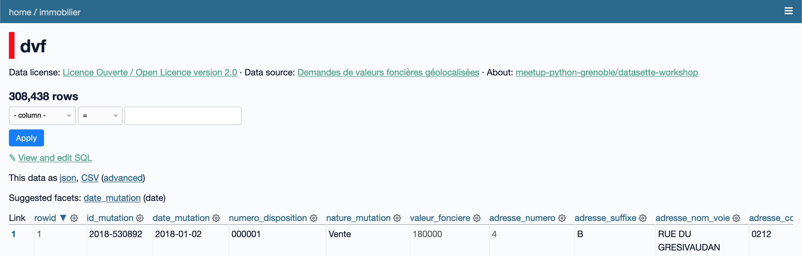

# ✈️ Tour d'horizon

Avant de commencer à analyser des données, prenons quelques minutes pour comprendre comment fonctionne Datasette. Pour obtenir tous les détails d'utilisation de Datasette, veuillez vous référer à la [documentation officielle](https://docs.datasette.io).

## Interface web

Datasette permet de visualiser une ou plusieurs bases de données [SQLite](https://www.sqlite.org).
C'est le seul type de base de données compatible avec Datasette pour le moment.

Par exemple, pour démarrer Datasette avec la base de données de l'atelier `immobilier.db` :

```bash
datasette data/immobilier.db
```

En accédant à l'interface web via l'URL affichée dans le terminal, on obtient :



La page d'accueil de Datasette liste les bases de données associée (ici `immobilier` uniquement) avec quelques informations complémentaires :

- `immobilier` : le nom de la base de données SQLite (extrait depuis le nom du fichier)
- `2 tables` : indication du nombre total de tables contenues dans la base
- `dvf, communes` : la liste des tables contenues dans la base

En cliquant sur `immobilier`, nous obtenons une vue détaillée de la base de données :


La vue de base de données donne plus d'informations sur chacune des tables de la base de données : nom, colonnes, nombre de lignes. Elle permet également de lancer des requêtes SQL.

En cliquant sur la table `dvf`, nous obtenons la vue d'exploration de données principale :


Nous utiliserons principalement cette vue pour [l'exploration de données](exploration.md).

## Métadonnées

Datasette est configurable via un fichier de métadonnées au format JSON ou YAML (ce dernier étant humainement plus simple à manipuler et permettant d'inclure des chaînes de caractères multilignes très pratiques pour le HTML et le SQL).

Pour lancer Datasette avec le fichier de métadonné de l'atelier `metadata.yml` :

```bash
datasette --metadata data/metadata.yml data/immobilier.db
```

La page d'accueil de Datasette est maintenant personnalisée :


Voici le contenu du fichier `metadata.yml` permettant de personnaliser la page d'accueil :

```yaml
title: Datasette Workshop
about: meetup-python-grenoble/datasette-workshop
about_url: https://github.com/meetup-python-grenoble/datasette-workshop
description_html: |-
  Exploration de données avec <a href="https://datasette.io">Datasette</a>
```

Il est également possible d'annoter la base de données avec les sources et licences des données sous-jacentes :



En ajoutant les métadonnées suivantes uniquement pour les tables `dvf` et `communes` de la base de données `immobilier` :

```yaml
databases:
  immobilier:
    tables:
      dvf:
        source: Demandes de valeurs foncières géolocalisées
        source_url: https://www.data.gouv.fr/fr/datasets/demandes-de-valeurs-foncieres-geolocalisees/
        license: Licence Ouverte / Open Licence version 2.0
        license_url: https://www.etalab.gouv.fr/licence-ouverte-open-licence/
      communes:
        source: France Geojson
        source_url: https://github.com/gregoiredavid/france-geojson/
        license: Licence Ouverte / Open Licence version 2.0
        license_url: https://www.etalab.gouv.fr/licence-ouverte-open-licence/
```

Beaucoup d'autres paramètres sont configurables via le fichier de métadonnées (descriptions et unités des colonnes, ordre de tri par défaut, etc.), veuillez vous référer à la [documentation officielle](https://docs.datasette.io/en/stable/metadata.html) pour plus de détails.

## Plugins

L'application Datasette embarque un large panel de fonctionnalités génériques mais en fonction des besoins, Datasette a besoin d'être augmenté avec des fonctionnalités additionnelles. Le [système de _plugins_](https://docs.datasette.io/en/stable/plugins.html) de Datasette permet à tous les développeurs de s'intégrer dans l'application pour proposer des fonctionnalités additionnelles, par exemple :

- La visualisation de données
- Accéder à de nouvelles fonctions SQL
- Définir des formats d'export personnalisés
- Personnaliser l'affichage de certains types de données dans l'interface
- Ajouter des vues personnalisées
- Ajouter des moyens d'authentification et d'autorisation
- etc.

Pour installer un plugin :

```bash
datasette install <plugin-name>
```

Pour lister les plugins installés :

```bash
datasette plugins
```

!!! note
    Datasette embarque une liste de plugins pré-installés : la plupart des fonctionnalités de base de Datasette sont en réalité des plugins ! Pour lister tous les plugins y compris ceux distribués par défault : `datasette plugins --all`

Pour désinstaller un plugin :

```bash
datasette uninstall <plugin-name>
```

La [liste de plugins référencés](https://datasette.io/plugins) s'agrandit régulièrement, vous trouverez très certainement votre bonheur ! Sinon, vous pouvez [développer votre propre plugin](https://docs.datasette.io/en/stable/writing_plugins.html).

## Configuration

Enfin, Datasette possède quelques [options de configuration](https://docs.datasette.io/en/stable/settings.html), permettant notamment de spécifier le délai de temps maximum pour l'exécution de requêtes SQL. Nous avons déjà un fichier de configuration `settings.json` dans le dossier `data` de l'atelier.

Pour démarrer Datasette avec le dossier complet `data` contenant la base de données, les métadonnées et la configuration, nous utiliserons le mode [_configuration directory_](https://docs.datasette.io/en/stable/settings.html#configuration-directory-mode) :

```bash
datasette data/
```
