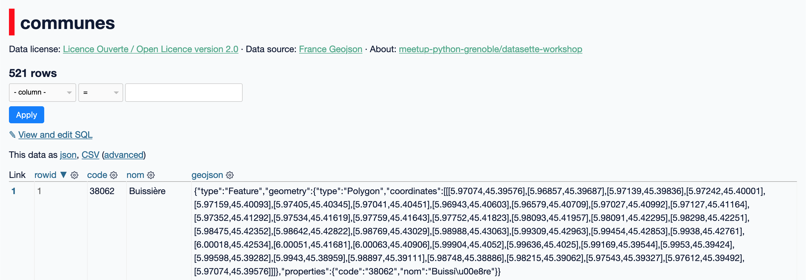
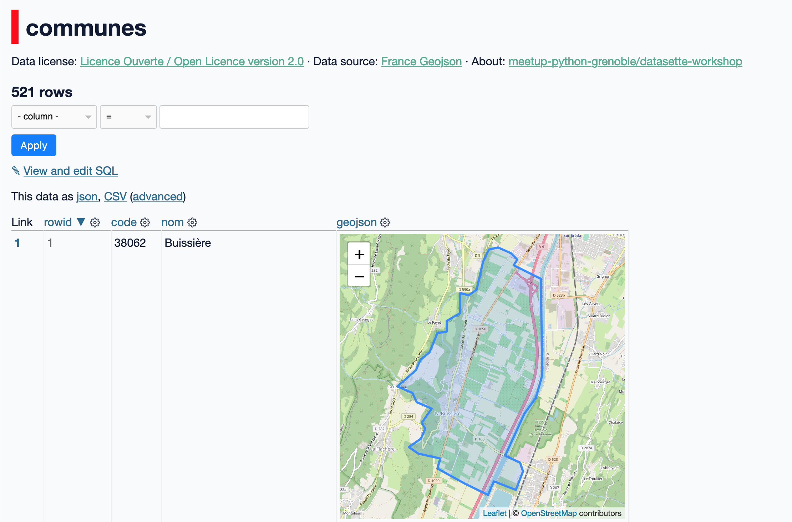
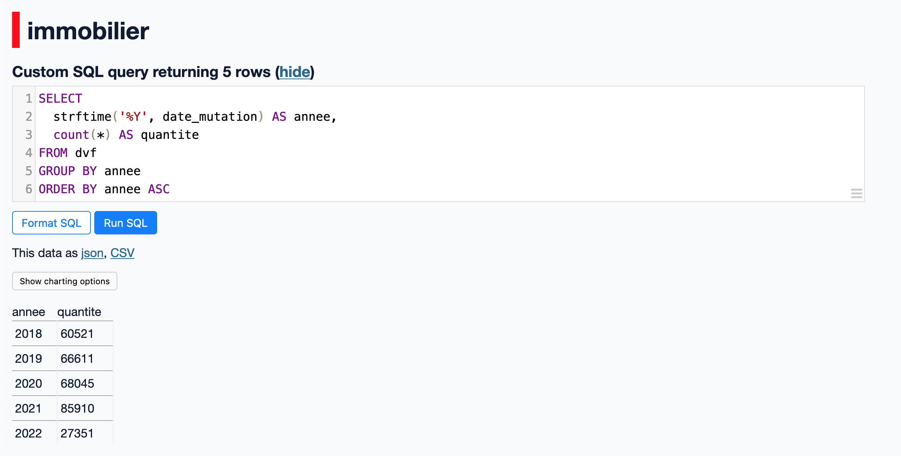
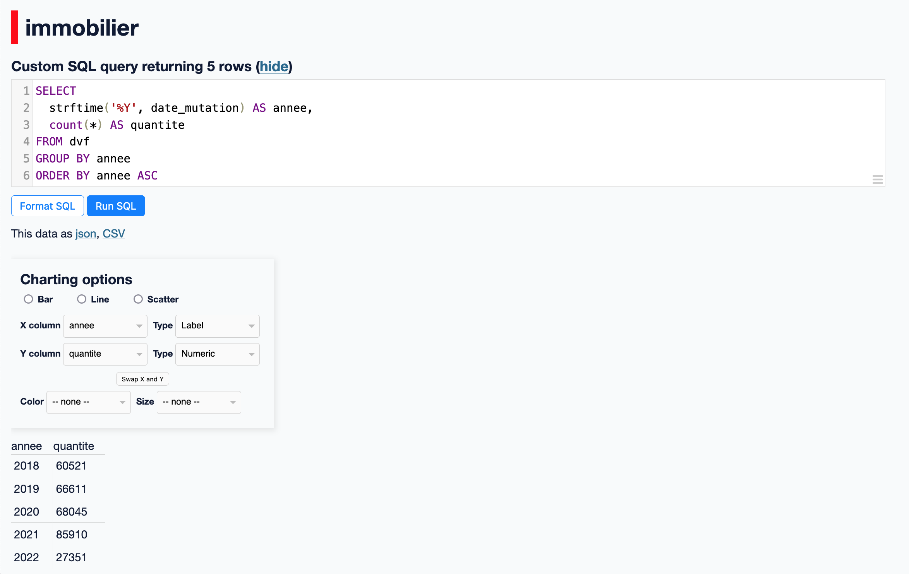
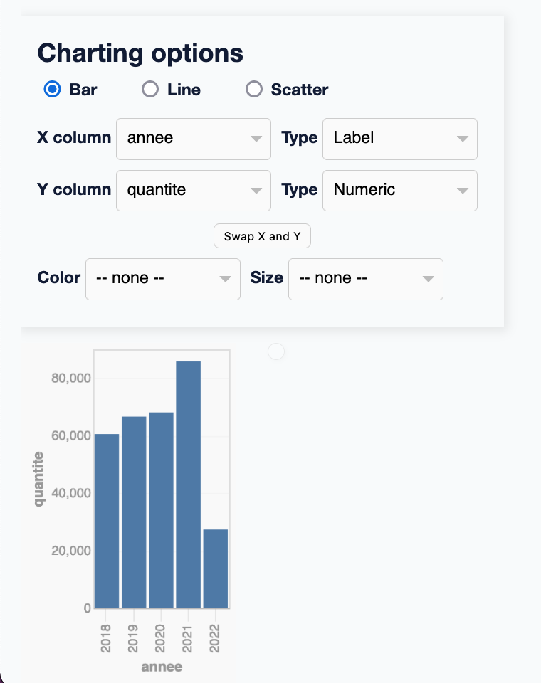
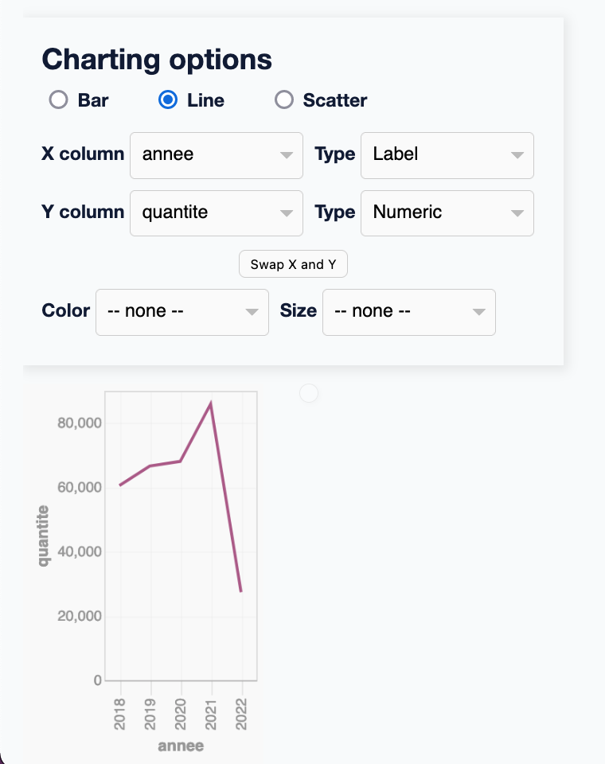

# Visualisation de données

Afin de faciliter l'analyse de données, il est possible d'intégrer de la visualisation de données directement dans Datasette, grâce à son écosystème de [plugins](https://docs.datasette.io/en/stable/plugins.html). La plupart des plugins mentionnés sont configurables pour un usage avancé, référez-vous à leurs documentations respectives pour plus de détails.

## Cartographie

Dans cet atelier nous travaillons avec des données ayant des propriétés géographiques. Affichons-les sur une carte !

Pour afficher les données géographiques d'une table (colonnes `latitude` et `longitude`) sur une carte, nous pouvons installer le plugin [`datasette-cluster-map`](https://datasette.io/plugins/datasette-cluster-map) :

```bash
datasette install datasette-cluster-map
```

Avec ce plugin installé, la table `dvf` s'affiche désormais avec une cartographie interactive :


Maintenant, si l'on observe la table `communes`, la colonne `geometry` contient une description géographique au format [GeoJSON](https://geojson.org) :



Ces informations GeoJSON peuvent nous être utiles pour afficher des cartes complexes telles que les _choroplèthes_. Pour simplement afficher un aperçu des contours géographiques de chaque commune, nous pouvons utiliser le plugin [`datasette-leaflet-geojson`](https://datasette.io/plugins/datasette-leaflet-geojson) :

```bash
datasette install datasette-leaflet-geojson
```

Avec ce plugin installé, la table `communes` s'affiche désormais avec un aperçu de la zone géographique de chaque commune :



## Visualisation

Pour rapidement afficher des visualisations de données génériques lors de l'exploration de données, nous pouvons utiliser le plugin [`datasette-vega`](https://datasette.io/plugins/datasette-vega) :

```bash
datasette install datasette-vega
```

L'interface web de Datasette est désormais enrichit d'un affichage de graphique "Show charting options" :





En sélectionnant les options d'affichage désirées, nous obtenons les visualisations directement dans l'interface :





## Tableaux de bord

Les plugins mentionnés précédemment sont très utiles pour des explorations et analyses de données rapides mais pas du tout adaptés à la construction de visualisations de données reproductibles, configurables et composables comme nous pourrions le retrouver dans des systèmes _d'informatique décisionnelle_ (_business intelligence_) tels que Metabase, Tableau ou PowerBI.

Le plugin [`datasette-dashboards`](https://datasette.io/plugins/datasette-dashboards) permet ce cas d'utilisation en configurant des tableaux de bords grâce au fichier de métadonnées de Datasette :

```bash
datasette install datasette-dashboards
```

Le plugin permet notamment de :

- Définir des tableaux de bords
- Définir des visualisations à partir d'une requête SQL
- Définir des visualisation en intégrant des bibliothèques de rendus telles que Vega-Lite et Leaflet.js
- Définir des filtres pour configurer dynamiquement les visualisations
- Organiser les tableaux de bords avec un système de grille.

Vous pouvez voir une démonstration en ligne des fonctionnalités offertes par le plugin : https://datasette-dashboards-demo.vercel.app
